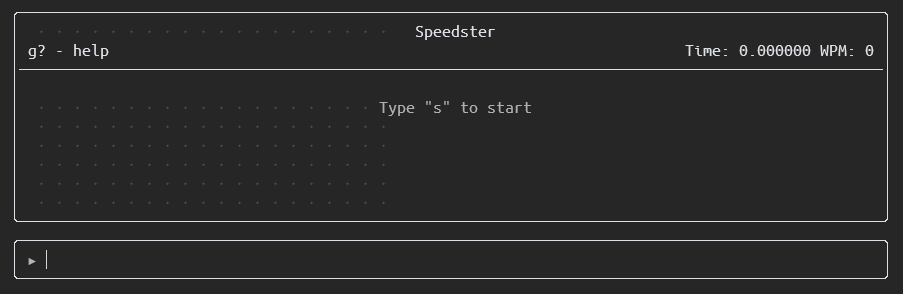
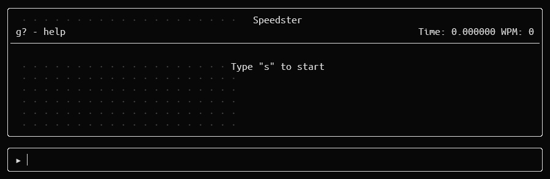
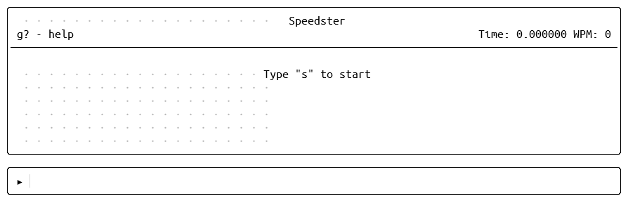

# speedster.nvim


Plugin to warm-up and practice typing skill and speed

## 🪧 Demo

### Usage

<div align="center">


</div>

### 📌 Layout

- Help menu at top left corner
- Time at top right corner
- Display in the middle
- Prompt at the bottom

<div align="center">



</div>

### 🎨 Themes

Dark Mode

<div align="center">



</div>

Light Mode

<div align="center">



</div>

## ⬇️ Installation

### [vim-plug](https://github.com/junegunn/vim-plug)

```lua
Plug 'ydkulks/speedster.nvim'
```

### [packer.nvim](https://github.com/wbthomason/packer.nvim.git)

```lua
use {
  'ydkulks/speedster.nvim',
  config=function()
    local config = require('speedster.config')
    config.setup({
      num_char = 80,
      symbols = 2,
      dark_theme = {
        Title = 'guifg=LightGrey ctermfg=7',
        Text = 'guifg=#afafaf ctermfg=145',
        Hr = 'guifg=LightGrey ctermfg=7',
        Border = 'guifg=LightGrey ctermfg=7'
      },
    })
  }
```

### [lazy.nvim](https://github.com/folke/lazy.nvim)

```lua
-- Lazy.nvim uses vim-plug.
-- Follow vim-plug config instruction above
```

## 🆘 Help

```vim
:help speedster.nvim
```

## ⚙️ Configuration

Refer `:help speedster_config` help docs for updated guide on configuration

```lua
-- init.lua
require("speedster.config").setup({
    -- Default values
    num_char = 50,     -- Number of characters displayed
    symbols = 1,       -- Number of words replaced with symbols
    dark_theme = {     -- Dark theme
      Title = 'guifg=LightGrey ctermfg=7',
      Text = 'guifg=#afafaf ctermfg=145',
      Hr = 'guifg=LightGrey ctermfg=7',
      Border = 'guifg=LightGrey ctermfg=7'
    },
    light_theme = {    -- Light theme
      Title = 'guifg=#000000 ctermfg=16',
      Text = 'guifg=#000000 ctermfg=16',
      Hr = 'guifg=#000000 ctermfg=16',
      Border = 'guifg=#3b4048 ctermfg=238'
    }
})
```

## 📄 TODO

- [x] Themes
- [x] Config option to customize settings
- [x] Test compatibility with other plugin managers
<!-- - [ ] Resize buffer automatically -->

## 🐛 Known Bugs & Limitation

- Not able to disable some plugins in prompt buffer that affects typing
